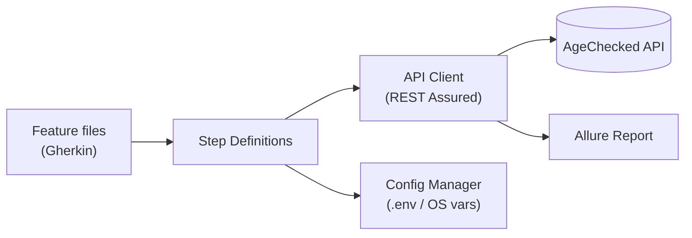

# AC API Automation (REST Assured + Cucumber + Allure)

A clean, simple, data-driven BDD framework for testing the AgeChecked `AC0137`
remote age-check API.

## Stack
- Java 17, Maven
- REST Assured for HTTP calls
- Cucumber (JUnit 4 runner) for BDD feature files, data-driven via Scenario Outline / Examples
- Lombok for request POJO builders
- Allure for test reporting

## Prerequisites

- **JDK 17** — verify with `java -version`
- **Maven 3.8+** — verify with `mvn -version`
- **Lombok IDE plugin** — [AgeCheckRequest](src/test/java/com/agechecked/models/AgeCheckRequest.java)
  uses Lombok (`@Data`/`@Builder`) to generate getters/setters/builder at
  compile time. Install the Lombok plugin for your IDE (built into recent
  IntelliJ IDEA; for VS Code / Eclipse install the "Lombok Annotations
  Support" plugin) and enable annotation processing, otherwise the IDE will
  show false compile errors even though `mvn test` builds fine.
- A local `.env` file with valid `BASE_URL` / `MERCHANT_SECRET_KEY` values
  (see [Configuration](#configuration) below) — required before running any tests.

## Installation

1. **Clone the repository**
   ```powershell
   git clone <repository-url>
   cd acapiautomationbdd_rest_new
   ```
2. **Verify your toolchain** matches [Prerequisites](#prerequisites):
   ```powershell
   java -version
   mvn -version
   ```
3. **Resolve/install dependencies** (downloads Cucumber, REST Assured, Allure,
   Lombok, etc. into your local `~/.m2` repository):
   ```powershell
   mvn -q dependency:resolve
   ```
   or simply let the first `mvn test` run do it automatically.
4. **Import into your IDE** as a Maven project (IntelliJ IDEA: *Open* the
   folder and let it auto-detect `pom.xml`; VS Code: install the *Extension
   Pack for Java* and open the folder). Make sure the Lombok plugin is
   installed and annotation processing is enabled (see [Prerequisites](#prerequisites)).
5. **Create your local `.env` file** from the committed template and fill in
   real values (see [Configuration](#configuration) for the full details):
   ```powershell
   Copy-Item .env.example .env
   ```
6. **Verify the setup** by compiling the test sources without running tests:
   ```powershell
   mvn -q test-compile
   ```
   A clean, output-free run means the toolchain, dependencies, and Lombok
   annotation processing are all working correctly.
7. **Run the suite** (see [Running the tests](#running-the-tests)):
   ```powershell
   mvn test
   ```

## Configuration

`BASE_URL` and `MERCHANT_SECRET_KEY` are never hardcoded — they are resolved at
runtime from a single `.env` file (see [ConfigManager](src/test/java/com/agechecked/config/ConfigManager.java)),
so the same feature files and step definitions run unchanged against whichever
target the `.env` file points at.

The `.env` file holds **both** `dev` and `staging` values side by side
(`DEV_BASE_URL` / `DEV_MERCHANT_SECRET_KEY` and `STAGING_BASE_URL` /
`STAGING_MERCHANT_SECRET_KEY`), and the `ENV` variable selects which pair is
active.

### Providing values

For each key (`ENV`, `DEV_BASE_URL`, `DEV_MERCHANT_SECRET_KEY`,
`STAGING_BASE_URL`, `STAGING_MERCHANT_SECRET_KEY`), the value is resolved
(highest priority first):
1. An OS environment variable (e.g. set by CI) — always wins
2. A Java system property (`-Dkey=value` on the Maven command line, e.g.
   `mvn test -Denv=staging` — see the [pom.xml](pom.xml) `<env>` property)
3. The single `.env` file at the project root (git-ignored)

Copy the committed example file to a real, git-ignored file and fill in real values:

```powershell
Copy-Item .env.example .env
```

```
# .env
ENV=dev

DEV_BASE_URL=https://dev.agechecked.com
DEV_MERCHANT_SECRET_KEY=<your-dev-secret-key>

STAGING_BASE_URL=https://staging.agechecked.com
STAGING_MERCHANT_SECRET_KEY=<your-staging-secret-key>
```

To point the suite at a different target, change `ENV` in `.env` to
`dev` or `staging`, override it for a single session without touching the
file:

```powershell
$env:ENV = "staging"
```

or pass it as a Maven system property, which [ConfigManager](src/test/java/com/agechecked/config/ConfigManager.java)
resolves the same way (both `-Denv` and `-DENV` work):

```powershell
mvn test "-Denv=staging"
```

`ENV` defaults to `dev` if not set. Individual `DEV_*` / `STAGING_*` values
can also be overridden per-session the same way, e.g. `$env:STAGING_BASE_URL = "..."`.

## Running the tests

```powershell
mvn test
```

The resolved base URL is written to the Allure `environment.properties` file
(see [Hooks](src/test/java/com/agechecked/hooks/Hooks.java)), so the generated
report clearly shows which target was tested.

## Allure report

Allure results are written to `target/allure-results` on every run
(configured via the `allure-cucumber7-jvm` Cucumber plugin).

Generate and open the HTML report locally with the
[Allure commandline](https://allurereport.org/docs/install/) (`scoop install allure`
or `npm i -g allure-commandline`), or via the Maven plugin:

```powershell
mvn test
mvn allure:report   # builds target/allure-report
mvn allure:serve     # builds + opens the report in a browser
```

Plain Cucumber HTML/pretty reports are still generated at
`target/cucumber-reports/cucumber.html` for a quick, dependency-free view.

## Folder structure

```
acapiautomationbdd_rest_new/
├── .env.example                          # Template for local .env (committed)
├── .env                                  # Real secrets (git-ignored, not committed)
├── bitbucket-pipelines.yml               # Bitbucket CI/CD pipeline definition
├── pom.xml                               # Maven build, dependencies, Surefire/Allure config
├── README.md
└── src/
    └── test/
        ├── java/
        │   └── com/agechecked/
        │       ├── config/
        │       │   └── ConfigManager.java        # Resolves ENV / BASE_URL / MERCHANT_SECRET_KEY
        │       ├── client/
        │       │   └── ApiClient.java             # REST Assured HTTP wrapper (Allure-instrumented)
        │       ├── models/
        │       │   └── AgeCheckRequest.java       # Lombok request POJO (builder pattern)
        │       ├── stepdefinitions/
        │       │   └── AC0137StepDefinitions.java # Given/When/Then glue code
        │       ├── hooks/
        │       │   └── Hooks.java                 # @BeforeAll — writes Allure environment.properties
        │       └── runner/
        │           └── CucumberTestRunner.java     # JUnit4 + Cucumber + Allure entry point
        └── resources/
            ├── allure.properties                  # Allure results directory config
            └── features/
                └── ac0137_age_verification.feature # BDD scenarios (Scenario Outline / Examples)
```

| Package | Responsibility |
|---|---|
| `config` | Single source of truth for environment configuration; OS env vars override `.env` file values. |
| `client` | Thin, reusable REST Assured wrapper; every call is auto-attached to the Allure report. |
| `models` | Request payload POJOs built with Lombok `@Builder`/`@Data`. |
| `stepdefinitions` | Cucumber step implementations that translate Gherkin steps into `ApiClient` calls and assertions. |
| `hooks` | Cross-cutting Cucumber lifecycle hooks (e.g., Allure environment metadata). |
| `runner` | JUnit 4 entry point wiring Cucumber, glue packages, and reporting plugins together. |
| `resources/features` | Gherkin feature files; test data lives in `Examples` tables, not in code. |

## Framework architecture



A test scenario in a **feature file** is executed by its **step definitions**,
which use the **API client** (configured via **Config Manager**) to call the
**AgeChecked API**; every call and result is captured in the **Allure report**.

## Adding new data-driven scenarios

Add rows to the `Examples` table of the relevant `Scenario Outline` in
[ac0137_age_verification.feature](src/test/resources/features/ac0137_age_verification.feature) —
no code changes are required.

## Adding a new feature file and step definitions

Use this when you need to test a **new endpoint/flow** rather than just add
data to an existing scenario.

1. **Create the feature file** under `src/test/resources/features/`, named
   after the API/flow under test, e.g. `src/test/resources/features/ac0138_something.feature`:
   ```gherkin
   Feature: AC0138 something check

     Background:
       Given the AgeChecked API base URL is configured

     Scenario Outline: <describe the happy path>
       Given an AC0138 request for the following applicant
         | field     | value       |
         | reference | <reference> |
       When I send the AC0138 request
       Then the response status code should be 200

       Examples:
         | reference  |
         | test_001   |
   ```
   Cucumber auto-discovers any `.feature` file under this folder — no runner
   changes needed as long as [CucumberTestRunner](src/test/java/com/agechecked/runner/CucumberTestRunner.java)'s
   `features` path still points at `src/test/resources/features`.

2. **Add a request model (if needed)** under `src/test/java/com/agechecked/models/`,
   following the [AgeCheckRequest](src/test/java/com/agechecked/models/AgeCheckRequest.java)
   pattern (`@Data` + `@Builder`, field names matching the API's JSON contract).

3. **Add a step definitions class** under `src/test/java/com/agechecked/stepdefinitions/`,
   e.g. `AC0138StepDefinitions.java`, following the structure of
   [AC0137StepDefinitions](src/test/java/com/agechecked/stepdefinitions/AC0137StepDefinitions.java):
   - Map each `Given`/`When`/`Then` step to a method.
   - Build the request via the model's builder.
   - Call `ApiClient.post("/api/acapiremote/ac0138", request)` (extend
     [ApiClient](src/test/java/com/agechecked/client/ApiClient.java) with
     `get`/`put`/`delete` helpers first if the new endpoint needs them).
   - Assert with Hamcrest, and attach the response on failure via `@After`
     the same way the existing step definitions do.
   - No runner changes are required — `glue` already points at the whole
     `com.agechecked.stepdefinitions` package.

4. **Verify locally before committing:**
   ```powershell
   mvn -q test-compile
   mvn test
   ```

5. **Keep test data in the feature file**, not hardcoded in step
   definitions, so new scenarios can be added via `Examples` rows alone.

## Committing and pushing to Bitbucket

1. **Sync with the latest `main`/`develop` branch:**
   ```powershell
   git checkout main
   git pull origin main
   ```
2. **Create a feature branch** (use your team's naming convention, e.g.
   `feature/AC0138-something-check` or `bugfix/ac0137-flaky-status`):
   ```powershell
   git checkout -b feature/AC0138-something-check
   ```
3. **Stage and commit your changes** with a clear, conventional message:
   ```powershell
   git add src/test/resources/features/ac0138_something.feature `
           src/test/java/com/agechecked/models/Ac0138Request.java `
           src/test/java/com/agechecked/stepdefinitions/AC0138StepDefinitions.java
   git commit -m "Add AC0138 feature file and step definitions"
   ```
   > Never `git add .env` or commit real secrets — `.env` is already
   > git-ignored; double-check `git status` before committing.
4. **Run the full suite one more time** to catch regressions:
   ```powershell
   mvn test
   ```
5. **Push the branch to Bitbucket:**
   ```powershell
   git push -u origin feature/AC0138-something-check
   ```
6. **Open a pull request** in Bitbucket (Repository → *Create pull request*,
   or use the link Bitbucket prints after the push) targeting `main`/`develop`,
   and request a review before merging.

## Bitbucket CI/CD integration

A ready-to-use [bitbucket-pipelines.yml](bitbucket-pipelines.yml) is included
at the project root, so pushes and pull requests are automatically built and
tested — no local Allure/Maven install required for reviewers.

**What it runs:**
- `pull-requests: '**'` — every PR runs the suite against `dev` before merge.
- `branches: main` — every push to `main` re-runs the suite.
- `custom: staging-tests` — a manually-triggered pipeline (Bitbucket UI →
  *Pipelines* → *Run pipeline* → select `staging-tests`) that runs against
  `staging` using the `staging` Deployment environment.
- Each run uses the shared `mvn -B test` step, caches `~/.m2/repository` for
  faster builds, and publishes `target/allure-results`,
  `target/cucumber-reports`, and `target/surefire-reports` as pipeline
  artifacts (downloadable from the pipeline run page) even when tests fail.

**One-time setup in Bitbucket** (Repository settings → Repository variables,
and Repository settings → Deployments for the `staging` environment):

| Variable | Where | Secured? |
|---|---|---|
| `ENV` | Repository variable (`dev`) and `staging` Deployment variable (`staging`) | No |
| `DEV_BASE_URL` | Repository variable | No |
| `DEV_MERCHANT_SECRET_KEY` | Repository variable | **Yes** |
| `STAGING_BASE_URL` | `staging` Deployment variable | No |
| `STAGING_MERCHANT_SECRET_KEY` | `staging` Deployment variable | **Yes** |

These are consumed the same way as local runs — [ConfigManager](src/test/java/com/agechecked/config/ConfigManager.java)
reads them as OS environment variables, so **no `.env` file or code changes
are needed in CI**; the pipeline never touches the git-ignored local `.env`.

**Enabling it:** Bitbucket Pipelines must be turned on for the repository
(Repository settings → Pipelines → Settings → *Enable Pipelines*) before the
first push will trigger a run.

## Troubleshooting

| Symptom | Likely cause / fix |
|---|---|
| `IllegalStateException: Missing required configuration value: DEV_BASE_URL...` | The active `ENV` has no matching `_BASE_URL` / `_MERCHANT_SECRET_KEY`. Confirm `.env` exists at the project root (`Copy-Item .env.example .env`) and both values are filled in for the selected environment, or set them as OS env vars. |
| `IllegalStateException: Invalid ENV value: ...` | `ENV` must be exactly `dev` or `staging` (case-insensitive). Check for typos/extra whitespace in `.env`, the OS env var, or `-Denv=...`. |
| Lombok-generated methods (`builder()`, getters) show as compile errors in the IDE, but `mvn test` works | The Lombok IDE plugin isn't installed or annotation processing isn't enabled. See [Prerequisites](#prerequisites). |
| `mvn test` reports "No tests were executed" | Only classes matching `**/*TestRunner.java` are picked up by Surefire (see `pom.xml`). A new/renamed runner class must end in `TestRunner`. |
| `-javaagent` / AspectJ weaver error on startup | The `aspectjweaver` jar isn't in the expected local Maven repository path. Run `mvn -U dependency:resolve` (or delete `~/.m2/repository/org/aspectj` and re-run `mvn test`) to force it to re-download. |
| Changing `-Denv=staging` on the command line seems to have no effect | Fixed: `ConfigManager` now also reads Java system properties (as-is and lower-cased) in addition to OS env vars and `.env`, so `-Denv=staging` / `-DENV=staging` both work. If you still see this on an older checkout, pull the latest `ConfigManager.java`. |
| Allure report is empty / missing environment info | Ensure `mvn test` completed (even with test failures) before running `mvn allure:report` / `mvn allure:serve` — `target/allure-results` is only populated by a test run. |
